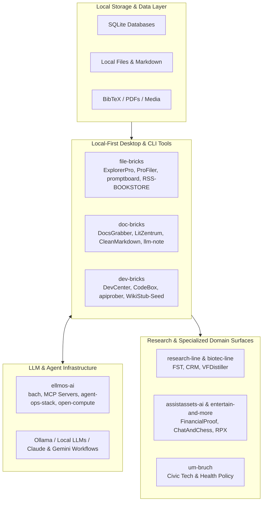

  

<h1 align="center">open-bricks</h1>

  <strong>Local-first desktop software for files, documents, developer workflows, research, and AI-assisted work.</strong> 
  Open source tools with no telemetry, no subscription layer, and optional local AI integration.

  
  
  
  
  

  <strong><a href="README.md">English</a></strong> | <strong><a href="README_de.md">Deutsch</a></strong>

  <a href="https://github.com/file-bricks">File tools</a> |
  <a href="https://github.com/doc-bricks">Document tools</a> |
  <a href="https://github.com/dev-bricks">Developer tools</a> |
  <a href="https://github.com/ellmos-ai">AI infrastructure</a> |
  <a href="https://github.com/research-line">Open research</a> |
  <a href="https://github.com/biotec-line">Bioinformatics</a> |
  <a href="https://github.com/assistassets-ai">Finance</a> |
  <a href="https://github.com/entertain-and-more">Games & RPG</a> |
  <a href="https://github.com/um-bruch">Civic tech</a>

---

> [!NOTE]
> **Machine-Readable Context**: For AI agents, LLM crawlers, and automated tools, a structured ecosystem directory is available at [`llms.txt`](https://github.com/open-bricks/.github/blob/main/llms.txt).

> [!IMPORTANT]
> **Local-First & Privacy First**: All tools in the open-bricks family store data locally on your machine without cloud subscription requirements, telemetry tracking, or forced remote dependencies.

**Public index verified: 2026-08-16.** The linked ecosystem currently exposes 105 active public product or research repositories plus 10 active public `.github` profile repositories (115 active public repositories in total). The `open-bricks` organization itself hosts the [`.github`](https://github.com/open-bricks/.github) profile and umbrella community-health repository; product code lives in the linked organizations below.

## Start Here

| Need | Go to | Best first repos |
|---|---|---|
| Manage local files, prompts, knowledge bases, RSS feeds, duplicate detection, and desktop utilities | [file-bricks](https://github.com/file-bricks) | [ExplorerPro](https://github.com/file-bricks/ExplorerPro), [ProFiler](https://github.com/file-bricks/ProFiler), [promptboard](https://github.com/file-bricks/promptboard), [NoteSpaceLLM](https://github.com/file-bricks/NoteSpaceLLM), [RSS-BOOKSTORE](https://github.com/file-bricks/RSS-BOOKSTORE) |
| Work with mail, PDFs, OCR, literature, media libraries, invoices, Markdown, and LLM notes | [doc-bricks](https://github.com/doc-bricks) | [UniversalDocsGrabber](https://github.com/doc-bricks/UniversalDocsGrabber), [UniversalMailCleaner](https://github.com/doc-bricks/UniversalMailCleaner), [LitZentrum](https://github.com/doc-bricks/LitZentrum), [CleanMarkdown](https://github.com/doc-bricks/CleanMarkdown), [llm-note](https://github.com/doc-bricks/llm-note) |
| Build, inspect, package, document, and maintain local software or multi-agent setups | [dev-bricks](https://github.com/dev-bricks) | [DevCenter](https://github.com/dev-bricks/DevCenter), [CodeBox](https://github.com/dev-bricks/CodeBox), [apiprober](https://github.com/dev-bricks/apiprober), [CareCenter-for-Codex](https://github.com/dev-bricks/CareCenter-for-Codex), [automizer-for-claude-desktop](https://github.com/dev-bricks/automizer-for-claude-desktop), [WikiStub-Seed](https://github.com/dev-bricks/WikiStub-Seed), [safe-start-for-codex](https://github.com/dev-bricks/safe-start-for-codex) |
| Connect desktop software to LLM agents, MCP servers, local memory, and computer-use workflows | [ellmos-ai](https://github.com/ellmos-ai) | [bach](https://github.com/ellmos-ai/bach), [agent-ops-stack](https://github.com/ellmos-ai/agent-ops-stack), [build-your-users-mind](https://github.com/ellmos-ai/build-your-users-mind), [ellmos-filecommander-mcp](https://github.com/ellmos-ai/ellmos-filecommander-mcp), [ellmos-controlcenter-mcp](https://github.com/ellmos-ai/ellmos-controlcenter-mcp), [open-compute](https://github.com/ellmos-ai/open-compute) |
| Find specialist tools for research, bioinformatics, finance, games, and civic technology | [research-line](https://github.com/research-line), [biotec-line](https://github.com/biotec-line), [assistassets-ai](https://github.com/assistassets-ai), [entertain-and-more](https://github.com/entertain-and-more), [um-bruch](https://github.com/um-bruch) | [functional-stability-theory](https://github.com/research-line/functional-stability-theory), [VFDistiller](https://github.com/biotec-line/VFDistiller), [FinancialProof](https://github.com/assistassets-ai/FinancialProof), [ChatAndChess](https://github.com/entertain-and-more/ChatAndChess), [regressangst](https://github.com/um-bruch/regressangst) |

## System Architecture

## What This Ecosystem Is

open-bricks is the umbrella profile for a family of small, practical, local-first tools. The shared product idea is simple:

- Your data stays on your machine.
- Desktop apps should still be useful without cloud accounts.
- AI should be an optional capability, not a forced dependency.
- Repositories should be inspectable by humans, GitHub search, and LLM agents.

Most software projects in the ecosystem use Python, PySide6 or web companions, SQLite, local file formats, and focused command-line or API surfaces. AI integrations usually connect through Ollama, Claude/Gemini-compatible workflows, or MCP servers from [ellmos-ai](https://github.com/ellmos-ai).

## Current Public Index

| Organization | Active public repos | Public focus | High-signal examples |
|---|---|---|---|
| [file-bricks](https://github.com/file-bricks) | 14 | Local-first desktop apps for files, prompts, knowledge work, privacy, RSS, cloud-sync repair, packaging, and browser workflows | [ExplorerPro](https://github.com/file-bricks/ExplorerPro), [ProFiler](https://github.com/file-bricks/ProFiler), [promptboard](https://github.com/file-bricks/promptboard), [ProfiPrompt](https://github.com/file-bricks/ProfiPrompt), [RSS-BOOKSTORE](https://github.com/file-bricks/RSS-BOOKSTORE), [CloudLockFixer](https://github.com/file-bricks/CloudLockFixer) |
| [doc-bricks](https://github.com/doc-bricks) | 9 | Mail, document intake, PDF/OCR, literature management, media libraries, invoices, Markdown, and LLM notes | [UniversalDocsGrabber](https://github.com/doc-bricks/UniversalDocsGrabber), [UniversalMailCleaner](https://github.com/doc-bricks/UniversalMailCleaner), [UniversalInvoiceMail](https://github.com/doc-bricks/UniversalInvoiceMail), [CleanMarkdown](https://github.com/doc-bricks/CleanMarkdown), [LitZentrum](https://github.com/doc-bricks/LitZentrum), [llm-note](https://github.com/doc-bricks/llm-note) |
| [dev-bricks](https://github.com/dev-bricks) | 9 | Developer tools, editors, API discovery, automation helpers, documentation seeds, and startup gates | [DevCenter](https://github.com/dev-bricks/DevCenter), [CodeBox](https://github.com/dev-bricks/CodeBox), [apiprober](https://github.com/dev-bricks/apiprober), [CareCenter-for-Codex](https://github.com/dev-bricks/CareCenter-for-Codex), [automizer-for-claude-desktop](https://github.com/dev-bricks/automizer-for-claude-desktop), [WikiStub-Seed](https://github.com/dev-bricks/WikiStub-Seed), [safe-start-for-codex](https://github.com/dev-bricks/safe-start-for-codex) |
| [ellmos-ai](https://github.com/ellmos-ai) | 57 | LLM operating systems, MCP servers, local agent memory, workflow automation, connectors, media tooling, computer-use modules, and portable agent utilities | [bach](https://github.com/ellmos-ai/bach), [agent-ops-stack](https://github.com/ellmos-ai/agent-ops-stack), [build-your-users-mind](https://github.com/ellmos-ai/build-your-users-mind), [gardener](https://github.com/ellmos-ai/gardener), [FileCommander MCP](https://github.com/ellmos-ai/ellmos-filecommander-mcp), [ControlCenter MCP](https://github.com/ellmos-ai/ellmos-controlcenter-mcp), [ServerCommander MCP](https://github.com/ellmos-ai/ellmos-servercommander-mcp), [open-compute](https://github.com/ellmos-ai/open-compute), [law-checker](https://github.com/ellmos-ai/law-checker), [task-master](https://github.com/ellmos-ai/task-master) |
| [research-line](https://github.com/research-line) | 5 | Open research repositories, proof notes, reproducible scripts, and Zenodo-linked publication context | [functional-stability-theory](https://github.com/research-line/functional-stability-theory), [crm-cosmology](https://github.com/research-line/crm-cosmology), [rh-even-dominance](https://github.com/research-line/rh-even-dominance), [fst-nash](https://github.com/research-line/fst-nash), [ai-elite-swr](https://github.com/research-line/ai-elite-swr) |
| [biotec-line](https://github.com/biotec-line) | 2 | Research-use bioinformatics and genetic variant tools | [VFDistiller](https://github.com/biotec-line/VFDistiller), [genotype-to-vcf](https://github.com/biotec-line/genotype-to-vcf) |
| [assistassets-ai](https://github.com/assistassets-ai) | 1 | Local-first financial analysis and no-advice assistant workflows | [FinancialProof](https://github.com/assistassets-ai/FinancialProof) |
| [entertain-and-more](https://github.com/entertain-and-more) | 3 | Local games, tabletop RPG workflows, lightweight audio utilities, and creative tools with optional AI assistance | [ChatAndChess](https://github.com/entertain-and-more/ChatAndChess), [rpx](https://github.com/entertain-and-more/rpx), [KlangpultLight](https://github.com/entertain-and-more/KlangpultLight) |
| [um-bruch](https://github.com/um-bruch) | 5 | Public-interest prototypes, health-policy analysis, civic-tech research, and local-first civic tools | [regressangst](https://github.com/um-bruch/regressangst), [verordnungsampel](https://github.com/um-bruch/verordnungsampel), [multiaxial-diagnostic-system](https://github.com/um-bruch/multiaxial-diagnostic-system), [locuterra](https://github.com/um-bruch/locuterra), [system-medicine](https://github.com/um-bruch/system-medicine) |
| [open-bricks](https://github.com/open-bricks) | 0 (1 `.github`) | Umbrella profile and community-health defaults | [`.github`](https://github.com/open-bricks/.github) |

## Search Phrases

Use these phrases when looking for the ecosystem in GitHub or web search:

- `open-bricks local-first desktop software`
- `file-bricks PySide6 desktop tools`
- `file-bricks promptboard local-first prompt manager`
- `file-bricks RSS-BOOKSTORE feed management`
- `doc-bricks CleanMarkdown local-first markdown viewer`
- `doc-bricks MailProcessor email tools`
- `doc-bricks llm-note local-first notes for agents`
- `dev-bricks CareCenter for Codex automation health`
- `dev-bricks automizer for Claude Desktop scheduled tasks`
- `dev-bricks WikiStub Seed documentation generator`
- `dev-bricks safe-start-for-codex Windows startup gate`
- `ellmos-ai MCP servers`
- `ellmos-ai agent-ops-stack local agent operations`
- `ellmos-ai build-your-users-mind theory of mind agent memory`
- `ellmos-ai open-compute computer use agent loop`
- `ellmos-ai law-checker automated compliance audit`
- `open-bricks software suite GitHub`
- `Umbruch health policy civic tech GitHub`
- `local-first AI desktop apps`

## Contributing

Each tool has its own repository, README, tests, and contribution path. Open issues and pull requests in the specific project repository. Organization-level community files are provided through this `.github` repository.

---

  <strong>open-bricks</strong> - open-source software for local work in the age of AI. 
  Built alongside <a href="https://github.com/ellmos-ai">ellmos-ai</a>.

<!-- last-checked: 2026-08-16 -->
