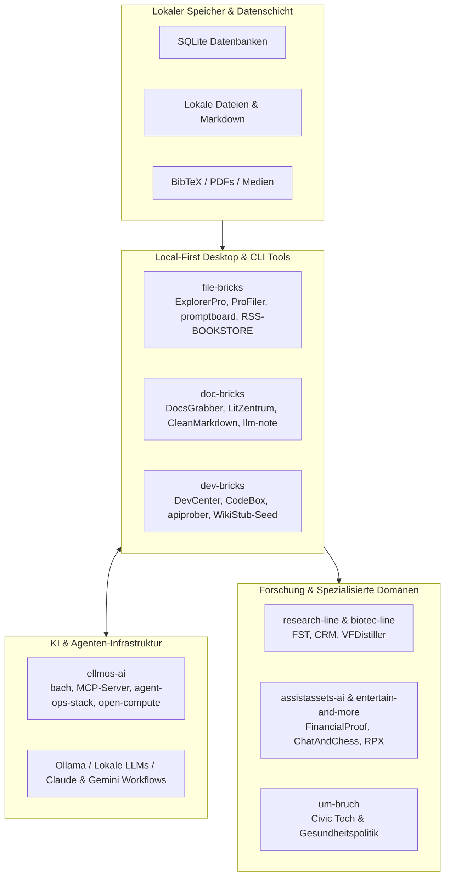

  

<h1 align="center">open-bricks</h1>

  <strong>Local-First Desktop-Software für Dateien, Dokumente, Entwickler-Workflows, Forschung und KI-gestützte Arbeit.</strong> 
  Open-Source-Werkzeuge ohne Telemetrie, ohne Abomodell und mit optionaler lokaler KI-Integration.

  
  
  
  
  

  <strong><a href="README.md">English</a></strong> | <strong><a href="README_de.md">Deutsch</a></strong>

  <a href="https://github.com/file-bricks">Datei-Tools</a> |
  <a href="https://github.com/doc-bricks">Dokumenten-Tools</a> |
  <a href="https://github.com/dev-bricks">Entwickler-Tools</a> |
  <a href="https://github.com/ellmos-ai">KI-Infrastruktur</a> |
  <a href="https://github.com/research-line">Open Research</a> |
  <a href="https://github.com/biotec-line">Bioinformatik</a> |
  <a href="https://github.com/assistassets-ai">Finanzen</a> |
  <a href="https://github.com/entertain-and-more">Games & RPG</a> |
  <a href="https://github.com/um-bruch">Civic Tech</a>

---

> [!NOTE]
> **Maschinenlesbarer Kontext**: Für KI-Agenten, LLM-Crawler und automatisierte Tools steht unter [`llms.txt`](https://github.com/open-bricks/.github/blob/main/llms.txt) eine strukturierte Ökosystem-Übersicht bereit.

> [!IMPORTANT]
> **Local-First & Datenschutz**: Alle Werkzeuge der open-bricks Familie speichern Daten lokal auf Ihrem System. Es bestehen keine Cloud-Abos, kein Telemetrie-Tracking und keine erzwungenen Remote-Abhängigkeiten.

**Öffentlicher Index verifiziert: 03.08.2026.** Das verlinkte Ökosystem umfasst aktuell 94 aktive öffentliche Produkt- und Forschungs-Repositories sowie 10 aktive öffentliche `.github` Profil-Repositories (insgesamt 104 aktive öffentliche Repositories). Die Organisation `open-bricks` selbst hostet das Profil- und Community-Health-Repository [`.github`](https://github.com/open-bricks/.github); der Produkt-Quellcode liegt in den verlinkten Teil-Organisationen.

## Einstieg & Schnellübersicht

| Bedarf | Organisation | Empfohlene Einstiegs-Repos |
|---|---|---|
| Lokale Dateien, Prompts, Wissensdatenbanken, RSS-Feeds, Duplikaterkennung und Desktop-Utilities | [file-bricks](https://github.com/file-bricks) | [ExplorerPro](https://github.com/file-bricks/ExplorerPro), [ProFiler](https://github.com/file-bricks/ProFiler), [promptboard](https://github.com/file-bricks/promptboard), [NoteSpaceLLM](https://github.com/file-bricks/NoteSpaceLLM), [RSS-BOOKSTORE](https://github.com/file-bricks/RSS-BOOKSTORE) |
| E-Mail, PDFs, OCR, Literaturverwaltung, Medienbibliotheken, Rechnungsdaten, Markdown und LLM-Notizen | [doc-bricks](https://github.com/doc-bricks) | [UniversalDocsGrabber](https://github.com/doc-bricks/UniversalDocsGrabber), [UniversalMailCleaner](https://github.com/doc-bricks/UniversalMailCleaner), [LitZentrum](https://github.com/doc-bricks/LitZentrum), [CleanMarkdown](https://github.com/doc-bricks/CleanMarkdown), [llm-note](https://github.com/doc-bricks/llm-note) |
| Lokale Software bauen, prüfen, paketieren, dokumentieren und Multi-Agenten-Setups steuern | [dev-bricks](https://github.com/dev-bricks) | [DevCenter](https://github.com/dev-bricks/DevCenter), [CodeBox](https://github.com/dev-bricks/CodeBox), [apiprober](https://github.com/dev-bricks/apiprober), [CareCenter-for-Codex](https://github.com/dev-bricks/CareCenter-for-Codex), [automizer-for-claude-desktop](https://github.com/dev-bricks/automizer-for-claude-desktop), [WikiStub-Seed](https://github.com/dev-bricks/WikiStub-Seed), [safe-start-for-codex](https://github.com/dev-bricks/safe-start-for-codex) |
| Desktop-Software mit LLM-Agenten, MCP-Servern, lokalem Gedächtnis und Computer-Use verbinden | [ellmos-ai](https://github.com/ellmos-ai) | [bach](https://github.com/ellmos-ai/bach), [agent-ops-stack](https://github.com/ellmos-ai/agent-ops-stack), [build-your-users-mind](https://github.com/ellmos-ai/build-your-users-mind), [ellmos-filecommander-mcp](https://github.com/ellmos-ai/ellmos-filecommander-mcp), [ellmos-controlcenter-mcp](https://github.com/ellmos-ai/ellmos-controlcenter-mcp), [open-compute](https://github.com/ellmos-ai/open-compute) |
| Spezialwerkzeuge für Forschung, Bioinformatik, Finanzen, Spiele und Civic Tech | [research-line](https://github.com/research-line), [biotec-line](https://github.com/biotec-line), [assistassets-ai](https://github.com/assistassets-ai), [entertain-and-more](https://github.com/entertain-and-more), [um-bruch](https://github.com/um-bruch) | [functional-stability-theory](https://github.com/research-line/functional-stability-theory), [VFDistiller](https://github.com/biotec-line/VFDistiller), [FinancialProof](https://github.com/assistassets-ai/FinancialProof), [ChatAndChess](https://github.com/entertain-and-more/ChatAndChess), [regressangst](https://github.com/um-bruch/regressangst) |

## Systemarchitektur

## Philosophie des Ökosystems

open-bricks bildet das gemeinsame Dach für praxisorientierte Local-First-Software. Der Grundsatz lautet:

- Ihre Daten verbleiben auf Ihrem Rechner.
- Desktop-Anwendungen müssen ohne Cloud-Konto voll funktionsfähig sein.
- KI ist eine optionale Ergänzung, keine erzwungene Abhängigkeit.
- Repositories sind transparent für Menschen, GitHub-Suche und KI-Agenten lesbar.

Die meisten Softwareprojekte nutzen Python, PySide6 oder Web-Begleiter, SQLite, lokale Dateiformate sowie schlanke CLI- oder API-Schnittstellen. KI-Erweiterungen binden sich typischerweise über Ollama, Claude/Gemini-Workflows oder MCP-Server von [ellmos-ai](https://github.com/ellmos-ai) ein.

## Aktueller Repository-Index

| Organisation | Aktive Repos | Fokus | Repräsentative Beispiele |
|---|---|---|---|
| [file-bricks](https://github.com/file-bricks) | 14 | Local-First Desktop-Apps für Dateien, Prompts, Wissensarbeit, Datenschutz, RSS und Reparatur von Cloud-Sync | [ExplorerPro](https://github.com/file-bricks/ExplorerPro), [ProFiler](https://github.com/file-bricks/ProFiler), [promptboard](https://github.com/file-bricks/promptboard), [ProfiPrompt](https://github.com/file-bricks/ProfiPrompt), [RSS-BOOKSTORE](https://github.com/file-bricks/RSS-BOOKSTORE), [CloudLockFixer](https://github.com/file-bricks/CloudLockFixer) |
| [doc-bricks](https://github.com/doc-bricks) | 9 | E-Mail-Intake, PDF/OCR, Literaturverwaltung, Medienbibliotheken, Rechnungs-Intake, Markdown und LLM-Notizen | [UniversalDocsGrabber](https://github.com/doc-bricks/UniversalDocsGrabber), [UniversalMailCleaner](https://github.com/doc-bricks/UniversalMailCleaner), [UniversalInvoiceMail](https://github.com/doc-bricks/UniversalInvoiceMail), [CleanMarkdown](https://github.com/doc-bricks/CleanMarkdown), [LitZentrum](https://github.com/doc-bricks/LitZentrum), [llm-note](https://github.com/doc-bricks/llm-note) |
| [dev-bricks](https://github.com/dev-bricks) | 9 | Entwickler-Werkzeuge, API-Erkennung, Automationshelfer, Dokumentations-Seeds und Start-Gates | [DevCenter](https://github.com/dev-bricks/DevCenter), [CodeBox](https://github.com/dev-bricks/CodeBox), [apiprober](https://github.com/dev-bricks/apiprober), [CareCenter-for-Codex](https://github.com/dev-bricks/CareCenter-for-Codex), [automizer-for-claude-desktop](https://github.com/dev-bricks/automizer-for-claude-desktop), [WikiStub-Seed](https://github.com/dev-bricks/WikiStub-Seed), [safe-start-for-codex](https://github.com/dev-bricks/safe-start-for-codex) |
| [ellmos-ai](https://github.com/ellmos-ai) | 46 | LLM-Betriebssysteme, MCP-Server, lokales Agentengedächtnis, Workflow-Automatisierung, Medien-Werkzeuge und Computer-Use | [bach](https://github.com/ellmos-ai/bach), [agent-ops-stack](https://github.com/ellmos-ai/agent-ops-stack), [build-your-users-mind](https://github.com/ellmos-ai/build-your-users-mind), [gardener](https://github.com/ellmos-ai/gardener), [FileCommander MCP](https://github.com/ellmos-ai/ellmos-filecommander-mcp), [ControlCenter MCP](https://github.com/ellmos-ai/ellmos-controlcenter-mcp), [ServerCommander MCP](https://github.com/ellmos-ai/ellmos-servercommander-mcp), [open-compute](https://github.com/ellmos-ai/open-compute), [law-checker](https://github.com/ellmos-ai/law-checker), [task-master](https://github.com/ellmos-ai/task-master) |
| [research-line](https://github.com/research-line) | 5 | Open-Science-Repositories, mathematische Beweisnotizen, reproduzierbare Skripte und Zenodo-Publikationskontext | [functional-stability-theory](https://github.com/research-line/functional-stability-theory), [crm-cosmology](https://github.com/research-line/crm-cosmology), [rh-even-dominance](https://github.com/research-line/rh-even-dominance), [fst-nash](https://github.com/research-line/fst-nash), [ai-elite-swr](https://github.com/research-line/ai-elite-swr) |
| [biotec-line](https://github.com/biotec-line) | 2 | Bioinformatik-Werkzeuge für Forschung und Genotyp-Konvertierung | [VFDistiller](https://github.com/biotec-line/VFDistiller), [genotype-to-vcf](https://github.com/biotec-line/genotype-to-vcf) |
| [assistassets-ai](https://github.com/assistassets-ai) | 1 | Local-First Finanzanalysen und beratungsfreie Assistenz-Workflows | [FinancialProof](https://github.com/assistassets-ai/FinancialProof) |
| [entertain-and-more](https://github.com/entertain-and-more) | 3 | Lokale Spiele, Tabletop-RPG-Workflows, leichte Audio-Utilities und kreative Werkzeuge mit optionaler KI-Unterstützung | [ChatAndChess](https://github.com/entertain-and-more/ChatAndChess), [rpx](https://github.com/entertain-and-more/rpx), [KlangpultLight](https://github.com/entertain-and-more/KlangpultLight) |
| [um-bruch](https://github.com/um-bruch) | 5 | Gemeinwohlorientierte Prototypen, Gesundheitspolitik, Civic-Tech-Forschung und lokale Werkzeuge | [regressangst](https://github.com/um-bruch/regressangst), [verordnungsampel](https://github.com/um-bruch/verordnungsampel), [multiaxial-diagnostic-system](https://github.com/um-bruch/multiaxial-diagnostic-system), [locuterra](https://github.com/um-bruch/locuterra), [system-medicine](https://github.com/um-bruch/system-medicine) |
| [open-bricks](https://github.com/open-bricks) | 0 (1 `.github`) | Dachorganisation und Community-Health-Standards | [`.github`](https://github.com/open-bricks/.github) |

## Suchbegriffe (Auffinbarkeit)

Nutzen Sie diese Suchbegriffe für GitHub- und Websuchen nach dem Ökosystem:

- `open-bricks local-first desktop software`
- `file-bricks PySide6 desktop tools`
- `file-bricks promptboard local-first prompt manager`
- `file-bricks RSS-BOOKSTORE feed management`
- `doc-bricks CleanMarkdown local-first markdown viewer`
- `doc-bricks MailProcessor email tools`
- `doc-bricks llm-note local-first notes for agents`
- `dev-bricks CareCenter for Codex automation health`
- `dev-bricks automizer for Claude Desktop scheduled tasks`
- `dev-bricks WikiStub Seed documentation generator`
- `dev-bricks safe-start-for-codex Windows startup gate`
- `ellmos-ai MCP servers`
- `ellmos-ai agent-ops-stack local agent operations`
- `ellmos-ai build-your-users-mind theory of mind agent memory`
- `ellmos-ai open-compute computer use agent loop`
- `ellmos-ai law-checker automated compliance audit`
- `open-bricks software suite GitHub`
- `Umbruch health policy civic tech GitHub`
- `local-first AI desktop apps`

## Mitwirken & Contribution

Jedes Werkzeug besitzt ein eigenes Repository mit eigenen Tests, Dokumentationen und Issue-Trackern. Bitte öffnen Sie Issues und Pull Requests direkt im jeweiligen Projekt-Repository. Organisationsweite Community-Standards werden zentral über dieses `.github` Repository bereitgestellt.

---

  <strong>open-bricks</strong> - Open-Source-Software für lokales Arbeiten im KI-Zeitalter. 
  Entwickelt an der Seite von <a href="https://github.com/ellmos-ai">ellmos-ai</a>.

<!-- last-checked: 2026-08-03 -->
